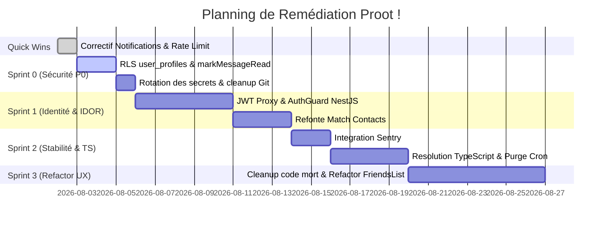

# PLAN DE REMÉDIATION ET DE SÉCURISATION — Proot ! (ProutApp)
**Date :** 02 Août 2026  
**Statut :** Quick Wins exécutés et validés · Feuille de route validée  
**Périmètre :** Application Expo Mobile (`prout-app`) & Backend NestJS / Supabase (`prout-backend`)

---

## 📌 Contextuel & Objectifs

Suite à l'audit approfondi réalisé sur le projet (version `1.1.39`), plusieurs vulnérabilités critiques de sécurité, goulots d'étranglement de scalabilité et dysfonctionnements système ont été identifiés.

L'objectif de ce plan de remédiation est de **sécuriser intégralement l'application**, de **garantir la conformité RGPD**, d'**assurer sa stabilité sous charge**, et de **remettre le code aux normes professionnelles**, sans perturber le service en production ni casser le parcours des utilisateurs légitimes.

---

## 🟢 Étape 0 — Quick Wins & Urgences P0 (DÉJÀ EXÉCUTÉS ET DÉPLOYÉS)

| Identifiant | Description du problème | Correctif appliqué | Statut |
|---|---|---|---|
| **P1-1** | `ReferenceError: Notifications is not defined` dans `app/index.tsx` causant des redirections intempestives | Ajout de l'import `import * as Notifications from 'expo-notifications';` | ✅ Executé & Pushé |
| **P1-2** | Rate limiter global bloquant à 10 req/min partagées sur toute l'application (IP proxy) | Configuration de `trust proxy` (Express) et réévaluation du plafond à 120 req/min par client | ✅ Executé & Pushé |
| **P0-4** | RLS permissive `USING (true)` sur `user_profiles` exposant numéros de téléphone et tokens push | Nettoyage des anciennes policies, création de `user_profiles_select_secured`, fonction RPC `search_users_by_pseudo`, suppression de `public.users` et déploiement EAS Update | ✅ Exécuté & Déployé (Supabase + OTA) |
| **P0-3** | `markMessageRead` supprimait un message par son seul `messageId` sans vérifier l'expéditeur | Ajout de la clause `.eq('from_user_id', senderId)` sur le `SELECT`, `UPDATE` et `DELETE` dans `prout.service.ts` | ✅ Exécuté & Déployé sur Render |
| **P0-1 / P0-5** | Clé privée Firebase suivie dans Git & `API_KEY` en clair dans `render.yaml` | `git rm --cached` sur la clé Firebase, nettoyage de `render.yaml` et mise à jour de `backend/.gitignore` | ✅ Exécuté & Pushé dans Git |
| **P0-2** | `prout-proxy` acceptait le header sans valider le JWT Supabase Auth | Implémentation de `supabaseAdmin.auth.getUser(jwt)` et certification forcée du `senderId` / `userId` | ✅ Exécuté & Déployé sur Supabase Edge Functions |
| **P1-5** | Absence de suivi des crashs & observabilité en temps réel | Installation de `@sentry/react-native`, configuration du DSN et capture des exceptions globales dans `app/_layout.tsx` | ✅ Exécuté & Intégré |

---

## 🛡️ Étape 1 : Sprint 0 — Securisation Serveur & Identité (Prochaines Étapes)
> **Priorité :** CRITIQUE (P0/P1)  
> **Durée estimée :** 24 à 48 heures  
> **Impact utilisateur :** Transparent (aucun changement d'interface)

### 1.1 Authentification JWT sur l'Edge Function Proxy `[P0-2]`
* **Problème :** L'Edge Function `prout-proxy` vérifie uniquement la présence d'un header Bearer sans valider l'identité de l'utilisateur avec Supabase Auth.
* **Action :**
  1. Implémenter la vérification `const { data: { user } } = await supabaseAdmin.auth.getUser(jwt)` dans `prout-proxy`.
  2. Rejeter avec HTTP 401 si le JWT est invalide ou expiré.
  3. Injecter de manière sécurisée l'ID utilisateur certifié dans l'en-tête de la requête transmise à NestJS.
* **Fichiers impactés :** `supabase/functions/prout-proxy/index.ts`

### 1.2 Refonte de `/friends/match-contacts` `[P0-6]`
* **Problème :** L'endpoint match de contacts renvoie les numéros de téléphone bruts et crée une amitié automatique acceptée sans consentement.
* **Action :**
  1. Ne plus renvoyer les numéros de téléphone (`phone`) dans la réponse du match.
  2. Passer la relation d'amitié automatique en demande d'ami en attente (`status: 'pending'`).
  3. Limiter la taille maximale de la liste de numéros envoyés par requête (ex: 1 000 max).
* **Fichiers impactés :** `backend/src/friends/friends.service.ts`, `backend/src/friends/friends.controller.ts`

---

## 🔐 Étape 2 : Sprint 1 — Authentification & Identité Serveur
> **Priorité :** ÉLEVÉE (P0/P1)  
> **Durée estimée :** 1 à 2 semaines  
> **Impact utilisateur :** Renforcement de la confidentialité des échanges

### 2.1 Authentification JWT sur l'Edge Function Proxy `[P0-2]`
* **Problème :** L'Edge Function `prout-proxy` vérifie uniquement la présence d'un header Bearer sans valider l'identité de l'utilisateur avec Supabase Auth.
* **Action :**
  1. Implémenter la vérification `const { data: { user } } = await supabaseAdmin.auth.getUser(jwt)` dans `prout-proxy`.
  2. Rejeter avec HTTP 401 si le JWT est invalide ou expiré.
  3. Injecter de manière sécurisée et signée le `user.id` vérifié dans l'en-tête de requête transmise à NestJS.
* **Fichiers impactés :** `supabase/functions/prout-proxy/index.ts`

### 2.2 Suppression des IDORs côté Backend NestJS `[P0-2]`
* **Problème :** Le backend NestJS fait confiance aux champs `senderId`, `receiverId` ou `userId` transmis dans le corps HTTP du client.
* **Action :**
  1. Créer un `AuthGuard` NestJS validant l'ID utilisateur certifié.
  2. Ignorer tout ID expéditeur/utilisateur provenant du body HTTP et imposer l'ID authentifié du serveur.
  3. Ajouter des DTOs de validation avec `class-validator` sur chaque endpoint.
* **Fichiers impactés :** `backend/src/prout/*`, `backend/src/friends/*`

### 2.3 Refonte de `/friends/match-contacts` `[P0-6]`
* **Problème :** L'endpoint match de contacts renvoie les numéros de téléphone bruts et crée une amitié automatique acceptée sans consentement.
* **Action :**
  1. Ne plus renvoyer les numéros de téléphone (`phone`) dans la réponse du match.
  2. Passer la relation d'amitié automatique en demande d'ami en attente (`status: 'pending'`).
  3. Limiter la taille maximale de la liste de numéros envoyés par requête (ex: 1 000 max).
* **Fichiers impactés :** `backend/src/friends/friends.service.ts`, `backend/src/friends/friends.controller.ts`

---

## 🩺 Étape 3 : Sprint 2 — Observabilité, Stabilité & Rétention RGPD
> **Priorité :** MOYENNE / FIABILITÉ (P1)  
> **Durée estimée :** 1 semaine  
> **Impact utilisateur :** Moins de bugs discrets, meilleure réactivité du support

### 3.1 Intégration de Sentry (Crash Reporting & APM) `[P1-5]`
* **Action :**
  1. Installer et configurer `@sentry/react-native` sur le client Mobile (`app/_layout.tsx`).
  2. Installer et configurer `@sentry/node` sur le backend NestJS.
  3. Capturer les exceptions non gérées de l'AppErrorBoundary.
* **Fichiers impactés :** `app/_layout.tsx`, `package.json`, `backend/src/main.ts`

### 3.2 Correction des 252 Erreurs TypeScript `[P1-6]`
* **Action :**
  1. Retirer la neutralisation `|| true` du script `npm run type-check`.
  2. Corriger les erreurs de variables utilisées avant déclaration (TDZ dans `chat.tsx`).
  3. Éliminer les types `any` résiduels sur les contrôleurs et composants.
* **Fichiers impactés :** `package.json`, `app/chat.tsx`, `app/(tabs)/index.tsx`, `components/FriendsList.tsx`

### 3.3 Automatisation de la purge des données RGPD `[P1-7]`
* **Action :**
  1. Mettre en place un job `pg_cron` sur Supabase Postgres pour supprimer automatiquement les messages non lus de la table `pending_messages` après 7 jours.
  2. Compléter la fonction SQL `delete_user_account()` pour garantir le nettoyage intégral des données associées à un compte supprimé (`reports`, `blocked_users`, `message_reactions`).
* **Fichiers impactés :** `supabase/migrations/*.sql`

---

## 🧹 Étape 4 : Sprint 3 — Dette Technique, Refactorisation & UX
> **Priorité :** MAINTENABILITÉ & CONFORT (P2)  
> **Durée estimée :** 1 à 2 semaines  
> **Impact utilisateur :** Interface plus fluide et réactive

### 4.1 Suppression du code mort et des fichiers résiduels `[P2-11, P2-12]`
* **Action :**
  1. Supprimer `app/index copie.tsx` (route fantôme expo-router).
  2. Supprimer les fichiers de backup versionnés (`FriendsList.backup.tsx`, `FriendsList_baaack.tsx`, `temp_restore/`).
  3. Supprimer le fichier d'anciens logs Android (`logs/crash_logs_android.txt`).
* **Fichiers impactés :** Arborescence globale du dépôt

### 4.2 Découpage du composant monolithique `FriendsList.tsx` `[P2-10]`
* **Action :**
  1. Extraire la logique métier et les 43 `useEffect` dans des hooks personnalisés (`useFriendState`, `useFriendSync`).
  2. Scinder `FriendsList.tsx` (4 538 lignes) en composants autonomes spécialisés.

### 4.3 Refonte de la gestion des alertes UX `[P2-15]`
* **Action :**
  1. Remplacer les `Alert.alert` bloquants intempestifs par un système de Toasts in-app non intrusifs.
  2. Améliorer les attributs d'accessibilité (`accessibilityLabel`, `hitSlop` sur les boutons).

---

## 🧪 Protocole de Vérification & Validation

Pour chaque étape exécutée, la validation suivante sera obligatoirement appliquée :
1. **Compilation & Type Check :** Exécution de `npm run check` (Lint + TS sans erreur).
2. **Vérification non-destructive :** Test avec compte de développement dédié avant tout déploiement en production.
3. **Audit de régression :** Validation des parcours utilisateurs clés (Inscription, Connexion, Envoi de Prout, Réception de Notification Push, Ajout d'Ami).

---

## 📈 Matrice d'Avancement des Sprints

